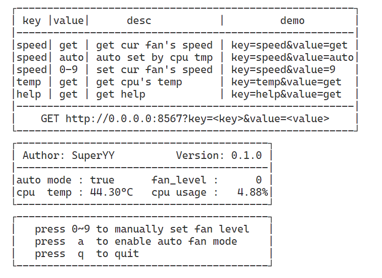

# fan-rs

## An I2C Fan Speed Control Program for Raspberry Pi

### Usage

#### One-time Execution
```bash
# Set the Fan Speed to 0 (min/stop)
./fan-rs -s 0
# Set the Fan Speed to 9 (max)
./fan-rs -s 9
# Set the Fan Speed automatically
./fan-rs -a true
# Show CPU Temperature
./fan-rs -t
# Show Help
./fan-rs -h
```


#### Persistent Execution
```bash
# Enable HTTP service and bind the port to 0.0.0.0:8567
./fan-rs -l --addr="0.0.0.0:8567"
```

> This mode allows controlling the fan speed through both terminal keystrokes and HTTP requests.
> 
> `auto mode` is enabled by default, which automatically adjusts the fan speed based on CPU utilization and temperature until the service is stopped.



### Build

```bash
cargo build --release --target=aarch64-unknown-linux-musl
```

### Overall Architecture

